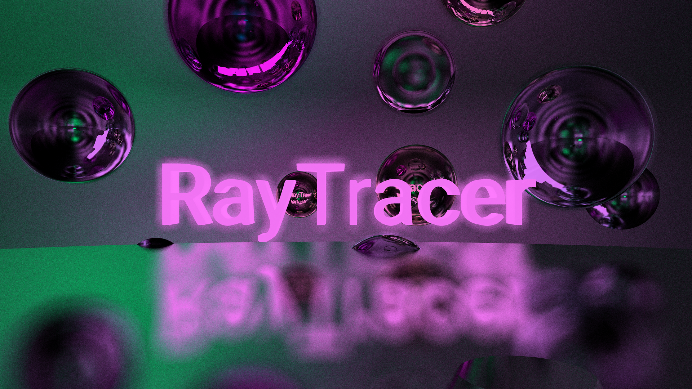

<h1 align="center">
  <br>
  <a href="http://www.amitmerchant.com/electron-markdownify"></a>
  <br>
  RayTracer
  <br>
</h1>

<h4 align="center">A RayTracer made in C++.</h4>

<p align="center">
  <a href="#key-features">Key Features</a> •
  <a href="#how-to-use">How To Use</a> •
</p>


## Key Features

* Real-time rendering of 3D scenes using ray tracing
* Support for basic geometric shapes (spheres, planes, etc.)
* Support for Obj file format for importing 3D models
* Basic lighting and shading models
* Camera controls for navigating the scene

## How To Use

### Clone this repository
```bash
git clone git@github.com:PouletHalal/RayTracer.git
```

### Go into the repository
```bash
cd RayTracer
```

### Build the program
```bash
mkdir build && cd build && cmake .. && cd ..
cmake --build build/ -j
```


### Run the program with graphical output
```bash
./raytracer scene.cfg -W 400 -H 400 -g
```

### Run the program without graphical output
```bash
./raytracer scene.cfg -W 400 -H 400 -images 200
```

Read our [documentation](https://github.com/PouletHalal/RayTracer/wiki) for more details on how to use the program, including how to create your own scenes and models.

## License

MIT

---

